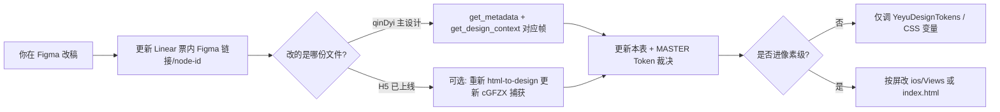

# Figma ↔ Linear ↔ 代码 对照表

> **用途**：按 Linear 设计轨 / 工程轨节奏，统一 Figma node、Issue、实现文件。  
> **最后同步**：2026-06-02（Figma MCP + **Linear MCP `get_issue` 附件**）  
> **视觉边界**：P0 **功能先行 + 最小 Token 对齐**，0515 大改 **不挡验收**；本表记录 diff，收口排期见 `ios/VISUAL_ROADMAP.md`。

---

## 1. 设计源文件（以 Linear 附件为准）

| 角色 | fileKey | Linear 中的名称 | 说明 |
|------|---------|-----------------|------|
| **高保真唯一源（Linear 附件）** | `cGFZXtYVmzWIQ7XqybecGP` | **夜屿 UI - 全界面/0515** | YUQ-27/30/32/33/40 等票的 Figma 链接均指向此文件；**改版后 node-id 以各 Issue 附件为准** |
| **流程线框 / 旧母版（参考）** | `qinDyiDu6GbAyqDys1FxdG` | 夜屿-isla · `Mindflow Wireframe Plan1` | 交互叙事与命名帧（`17:311` 首页等）；**勿与 0515 高保真 node 混用** |
| **H5 自动捕获（可能滞后）** | 同上 `cGFZX…` | `Page 1` · `Flow 01` · `1:3` 等 | html-to-design 历史快照；与 0515 新 node（如 `411:1996`）**不是同一帧** |

**链接模板**：`https://www.figma.com/design/cGFZXtYVmzWIQ7XqybecGP/0515?node-id=411-1996` → MCP 用 `nodeId=411:1996`。

---

## 2. 色板 diff（2026-06-02 抽样）

| Token 语义 | 捕获稿 `1:3`（Home） | `YeyuDesignTokens` / H5 | 备注 |
|------------|----------------------|-------------------------|------|
| 背景 | `#121620`（rgb 18,22,32） | iOS `#0B111D`；H5 `--bg: #121620` | iOS 略深，需改版时统一裁决 |
| 主色 / 发送钮 | `#FF9F68` → `#FF7E5F` 渐变 | iOS `#FFB86C`；H5 `--glow-primary: #FF9F68` | 色相接近，hex 不完全一致 |
| 输入/卡片面 | `#1e2330` | iOS `backgroundInput` `#292F39` | 捕获稿更贴近 H5 |
| 线框首页 `17:311` | 浅色线框（`get_design_context` 为 `#efefef` 系） | — | **勿当作深色成品**；以捕获稿或改版后的高保真为准 |

---

## 3. 设计轨（YUQ-27～40）↔ Figma ↔ 代码

Linear 项目：[夜屿 UI UX 精益设计](https://linear.app/yuqi-design/project/夜屿-ui-ux-精益设计-125fc515ba74)

| Issue | 状态 | Linear Figma 附件（0515） | 线框参考 `qinDyi…` | iOS | 同步状态 |
|-------|------|---------------------------|---------------------|-----|----------|
| [YUQ-27](https://linear.app/yuqi-design/issue/YUQ-27) | In Review | [page/home `411:1996`](https://www.figma.com/design/cGFZXtYVmzWIQ7XqybecGP/0515?node-id=411-1996) | `17:311` | `HomeView` | 高保真收口 ✅（背景插画 `HomeHeroBackground` + 两行问候 + 横向 chip `411:2024` + 玻璃 input box `411:2006` + 合规一行）；新增 Token：`inputGlass*`/`textPlaceholder0515`/`iconModel*`/`iconVoice*` |
| [YUQ-28](https://linear.app/yuqi-design/issue/YUQ-28) | Done | （附件无单独帧；见 27 首页内光球） | `702:862` 组件 | 首页光球 | Done 设计；实现待跟 0515 |
| [YUQ-29](https://linear.app/yuqi-design/issue/YUQ-29) | Done | 母版见 32 | `20:64` | `ChatView` | 已被 YUQ-32 取代 |
| [YUQ-30](https://linear.app/yuqi-design/issue/YUQ-30) | In Review | [左侧弹窗 `226:2399`](https://www.figma.com/design/cGFZXtYVmzWIQ7XqybecGP/0515?node-id=226-2399)（**仅视觉**） | `4:121` | `SideDrawerView` | 完全还原 ✅：暗色 Liquid Glass 面板 + 页眉关闭 icon + **成为会员 Banner（226:2407，月/山原生绘制）** + 4 入口（heart/pencil/tag/gear）+ 开抽屉轻触觉（`AppState.openDrawer()`）。Banner 点击暂占位「敬请期待」，**二级会员转化弹窗待 YUQI 后补**；支持鼓励真实页面同。见 [`ios/DRAWER_SCOPE.md`](../../ios/DRAWER_SCOPE.md) |
| [YUQ-32](https://linear.app/yuqi-design/issue/YUQ-32) | In Progress | [page chat `226:2460`](https://www.figma.com/design/cGFZXtYVmzWIQ7XqybecGP/0515?node-id=226-2460) | `20:64` | `ChatView` | 视觉收口 ✅：液态玻璃输入盒 + 0515 深色底 + 胶囊用户气泡（226:2484）+ **AI 思考步骤条（见 YUQ-35）** + **AI 回吐振动一次**（#6）。**真流式打字机（#7）依赖后端 SSE → YUQ-47 非 P0**，现为整包回退；AI 结构化小标题为稿子理想态，产线口语 prose，未强加 markdown |
| [YUQ-35](https://linear.app/yuqi-design/issue/YUQ-35) | Done(设计) | [状态1 `226:2516`](https://www.figma.com/design/cGFZXtYVmzWIQ7XqybecGP/0515?node-id=226-2516)、[状态2 `226:2568`](https://www.figma.com/design/cGFZXtYVmzWIQ7XqybecGP/0515?node-id=226-2568)、[状态3 `226:2621`](https://www.figma.com/design/cGFZXtYVmzWIQ7XqybecGP/0515?node-id=226-2621) | `21:311` | `ChatView.ThinkingIndicator` | ✅ 客户端思考动画：山形 icon + 三步文案（理解问题→梳理思绪→整理表达）渐变切换 + 文字微光扫过 + 减弱动效降级。**纯客户端 loading 动画，不依赖 SSE**；真流式步骤随 YUQ-47 |
| [YUQ-33](https://linear.app/yuqi-design/issue/YUQ-33) | In Review | [page chat check `415:2362`](https://www.figma.com/design/cGFZXtYVmzWIQ7XqybecGP/0515?node-id=415-2362) | `27:123` | `ChoiceGuideView` | 视觉收口 ✅：液态玻璃容器 + 单选圈选项 + 「或者其他你想说的?」提示，移除冗余顶栏标签。圈为视觉一致**不做预选**（点选即发送，异于静态稿的预勾选） |
| [YUQ-40](https://linear.app/yuqi-design/issue/YUQ-40) | In Review | [心情卡片弹出 `394:2232`](https://www.figma.com/design/cGFZXtYVmzWIQ7XqybecGP/0515?node-id=394-2232) | `224:433` | `ActionCardSheet` | 视觉收口 ✅：已对齐（标题/你的心情/换个角度/hero 行动卡/继续聊·保存卡片）；本轮微调 sheet 圆角 28 + hero 卡圆角 16 |
| [YUQ-36](https://linear.app/yuqi-design/issue/YUQ-36) | Done(设计) | [心情卡片-进行中 `226:2291`](https://www.figma.com/design/cGFZXtYVmzWIQ7XqybecGP/0515?node-id=226-2291)、[已完成 `253:614`](https://www.figma.com/design/cGFZXtYVmzWIQ7XqybecGP/0515?node-id=253-614) | — | `HistoryView` | **重做二级页对齐设计** ✅：自定义下划线文字 Tab（进行中/已完成）+ 玻璃卡（话题引文/行动正文/日期/「去完成」白胶囊）；已完成态「✓ 已完成」。替换原 segmented Picker + 系统 List。标题沿用「行动卡片」（与抽屉一致，稿子为「心情卡片」） |
| [YUQ-34](https://linear.app/yuqi-design/issue/YUQ-34) | In Progress | [界面语言 `226:2269`](https://www.figma.com/design/cGFZXtYVmzWIQ7XqybecGP/0515?node-id=226-2269) | — | `LanguageView` | 语言列表视觉对齐（中文–简/繁/English，三行+分割线）；**多语言切换仍 v1 外**，繁/English 诚实置「即将推出」，不做非功能 `保存` |
| [YUQ-37](https://linear.app/yuqi-design/issue/YUQ-37) | In Progress | [设置 `226:2802`](https://www.figma.com/design/cGFZXtYVmzWIQ7XqybecGP/0515?node-id=226-2802)、[记忆偏好 `226:2825`](https://www.figma.com/design/cGFZXtYVmzWIQ7XqybecGP/0515?node-id=226-2825) | — | 未做 | v1 外 |
| [YUQ-38](https://linear.app/yuqi-design/issue/YUQ-38) | In Progress | [设置页 `226:2844`](https://www.figma.com/design/cGFZXtYVmzWIQ7XqybecGP/0515?node-id=226-2844) | — | 设置子页占位 | 进行中 |
| [YUQ-39](https://linear.app/yuqi-design/issue/YUQ-39) | Todo | [记忆管理 `226:2868`](https://www.figma.com/design/cGFZXtYVmzWIQ7XqybecGP/0515?node-id=226-2868) | — | 设置「本地记忆」简化版 | P0 简化 / 全量 v1.1 |

**说明**：上表 Figma 列来自 **2026-06-02 Linear `get_issue` attachments**；改版后若你更新了 Issue 内 Figma 链接，以 Linear 为准并改本表。

---

## 4. 工程轨（YUQ-41～50）↔ 设计依赖

Linear 项目：[夜屿 · 端改造一期（iOS v1 工程）](https://linear.app/yuqi-design/project/夜屿-端改造一期ios-v1-工程-b110d35b90e9)

| Issue | 工程内容 | 对齐设计票 | 验收文档 |
|-------|----------|------------|----------|
| YUQ-41 | Epic | 上表全线 | `ios/P0_ACCEPTANCE.md` |
| YUQ-42 | Prompt + API | — | `prompts/`、`API_CHAT.md` |
| YUQ-43 | 脚手架 + Token | YUQ-27、Figma Variables | `YeyuDesignTokens.swift` |
| YUQ-44 | 出卡确认 | **YUQ-40**、`224:433` | P0 ✅ |
| YUQ-45 | 会话 + 续聊 | **YUQ-30**、`4:121` | P0 ✅ |
| YUQ-46 | 三选一 | **YUQ-33**、`27:123` | P0 ✅ |
| YUQ-47 | SSE / 思考条 | **YUQ-32**、`21:311` | `ios/V1.1_NOTES.md` |
| YUQ-48 | 主流程 | YUQ-27、32 | P0 ✅ |
| YUQ-49 | TestFlight | 设置/免责 | P0 外 |
| YUQ-50 | Monorepo 口径 | — | `MONOREPO.md` |

---

## 5. 建议同步节奏（改版后）



1. **设计 Done**：在 Linear 贴 **唯一** node 链接（优先 `qinDyi…` 改版帧）。  
2. **Agent 拉稿**：`get_screenshot` + `get_design_context`（必要时 `get_variable_defs`）。  
3. **写 diff**：更新本节 §2 色板 + §3 表「同步状态」。  
4. **工程**：P0 仍只动 Token；像素级需单独开里程碑（与「功能先行」决策一致）。

---

## 6. MCP 复现命令（Figma）

```text
# 列出主文件页面
get_metadata fileKey=qinDyiDu6GbAyqDys1FxdG

# 线框树（Mindflow）
get_metadata fileKey=qinDyiDu6GbAyqDys1FxdG nodeId=0:1

# 深色首页（捕获稿）
get_design_context fileKey=cGFZXtYVmzWIQ7XqybecGP nodeId=1:3
```

---

## 7. Linear MCP 使用说明

- 拉 Figma 链接：对每张票 `get_issue`（**attachments** 字段，勿只看 description）。  
- 若 Agent 报「MCP server does not exist: plugin-linear-linear」：多为**本会话启动时 MCP 未注入**，不是你的 Linear 配置坏了；**新开一条对话**或重载窗口后通常恢复。  
- 同步后可在 Issue 评论指向本文件：`FIGMA_LINEAR_SYNC.md`。

---

## 8. YUQ-27 首页 diff（`411:1996` vs `HomeView.swift`）

> 2026-06-02 自 Figma `get_design_context` + 当前 iOS 代码。**P0 仍为功能先行**；下表供改版收口或 v1.1 视觉迭代用。

| 维度 | 0515 `page/home` | 当前 iOS `HomeView` |
|------|------------------|---------------------|
| **背景** | 全屏 `bg-image` + 深灰渐变（约 `#0D0D0D`→`#313131`），月夜山景插画 | 纯色 `YeyuColor.backgroundBase`（`#0B111D`），无光球/插画 |
| **顶栏** | 仅左侧 Menu 24px（`Nav bar`） | 仅汉堡菜单 ✅；无右上扬声器/日期 |
| **问候区** | 主标题 26px 两行：「晚上好，」「欢迎来到夜屿。」；副标题 12px：「在这里分享你的困惑…」 | 先 **日期行**（footnote），再「{名}，今晚想聊点什么？」+ 固定副文案「小岛守夜人」 |
| **时段文案** | 设计稿写死「晚上好」 | 代码有 `formattedDate` + 时段问候逻辑，**文案体系不一致** |
| **Agent / 品牌视觉** | 插画在背景层（月/山），非独立 Orb 组件 | 旧捕获稿有中心光球；**0515 首页无 RN/H5 式 Orb** |
| **快捷话题 Chip** | **横向** `Chat card` 滚动，卡片 `#252525`、圆角 24、高 74 | **纵向** 全宽列表，surface 色 + 12px 圆角 |
| **输入区** | 底部大圆角 24 **玻璃框**（白边+半透明渐变）；内嵌 **模型 icon + 语音 icon**；占位「随便聊聊...」 | **胶囊** TextField + 右侧 **橙色圆形发送**（arrow.up）；无语音/模型按钮 |
| **合规** | 底栏 10px 居中：「本功能无法代替医学等安全合规声明」 | 首页 **未展示** 同类 footer（设置页可能有免责） |
| **首访昵称** | 帧内未体现 | `NameSetupView` 挡一层（产品逻辑有，稿需对齐是否保留） |

**P0 已做（最小）**：Token 登记 0515 色/圆角；首页 Chip 用 `surfacePromptCard` + `promptCard`；底部合规一行。

**v1.1 结构收口**：背景图、横向 Chip、玻璃输入框、问候 copy 与 `411:1996` 一致 — 见 `ios/VISUAL_ROADMAP.md`。

---

## 9. 改版后优先核对的帧（建议顺序）

与 [P0 主路径](https://github.com/yuqizhang1228-blip/yeyu-mvp/blob/main/ios/P0_ACCEPTANCE.md) 一致：

1. **`411:1996`**（YUQ-27）— 首页；勿再用捕获稿 `1:3`  
2. `226:2460`（YUQ-32）— 对话  
3. `415:2362`（YUQ-33）— 三选一  
4. `394:2232`（YUQ-40）— 出卡弹窗  
5. `226:2399`（YUQ-30）— 抽屉  
6. 行动卡片列表帧（待 Issue 附件补 node）  
7. `226:2269` / `226:2802` 系 — 设置与子页（34/37/38/39）  

---

*维护者：改版或收 Linear 后更新「最后同步」日期与 §2 色板。*
